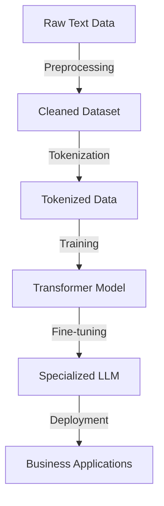
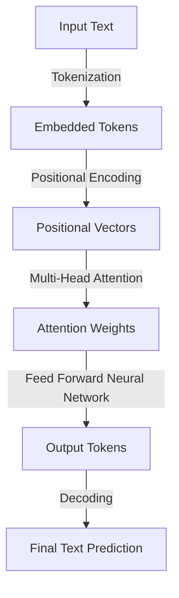
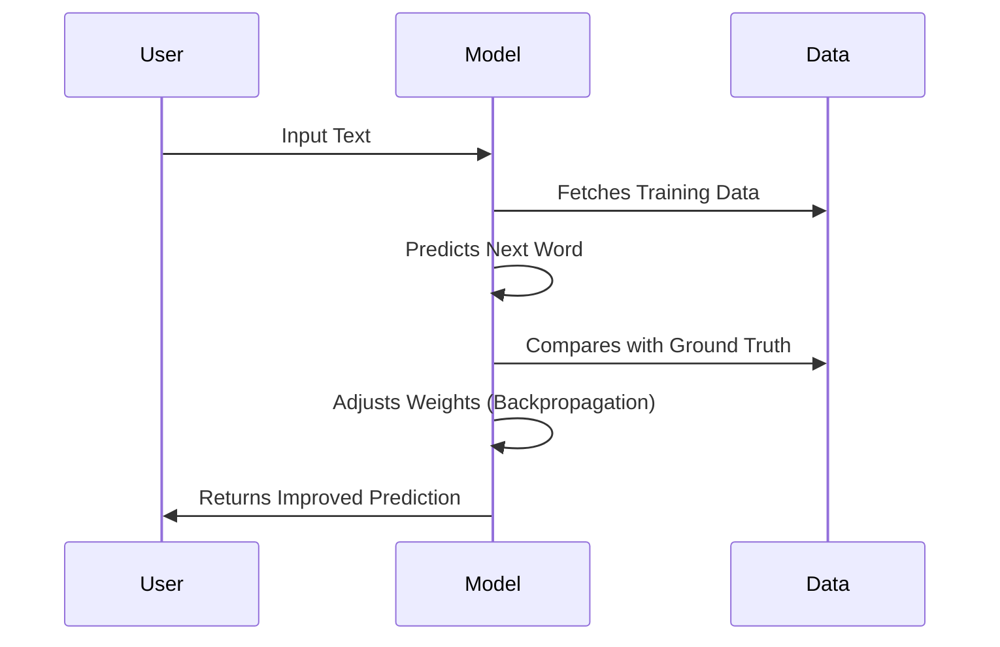

# 🔥 Understanding Large Language Models (LLMs) 🔥

## 📌 Overview
Large Language Models (LLMs) are **advanced AI models** designed to understand and generate human-like text. They are used in **chatbots, content creation, programming assistance, customer support, and more**. 

In this repository, we'll explore:  
✅ What an **LLM** is  
✅ How **LLMs work**  
✅ Real-world **business applications**  
✅ The **architecture** behind them  
✅ The **training process**  

---

## 🟢 1. What is a Large Language Model (LLM)?

A **Large Language Model (LLM)** is a deep learning model that processes **text** and **code** using an **artificial neural network (ANN)**. It is a subclass of **foundation models**, which are trained on vast datasets without human-labeled examples.  

### 🔹 Characteristics of LLMs:
- **Pre-trained on massive datasets** 🗄️📖
- **Self-supervised learning** (no manual labeling)  
- **Scalable** with **billions of parameters** 🧠  
- **Context-aware**: Understands language in **context**  

### 📊 Size of an LLM Dataset:
| Storage | Word Capacity |
|---------|--------------|
| **1GB** | ~178 Million Words |
| **1TB** | ~178 Billion Words |
| **1PB** | ~178 Trillion Words |

📌 **GPT-3** was trained on **45 terabytes** of text and contains **175 billion** parameters!

---

## 🟢 2. How LLMs Work 🧠

LLMs are built using **three key components**:

## **1️⃣ Data Collection**  
   - Extracted from books, articles, research papers, and internet conversations.
   - Pre-processing removes duplicates, errors, and unwanted text.

## **2️⃣ Model Architecture**  
   - Uses the **Transformer Neural Network** (introduced by Google in 2017).
   - Transformers utilize **self-attention** to understand relationships between words.

## **3️⃣ Training Process**  
   - The model predicts the **next word** in a sentence.
   - Gradually improves over multiple iterations using **backpropagation**.

---

## 📊 Flowchart: How LLMs Work  

## 🟢 3. Transformer Architecture 📜

The Transformer Model is at the core of LLMs. It uses self-attention mechanisms to process text.

## 🟢 4. Training Process: Step-by-Step 🔄

### 📌 How does an LLM learn?
### 1️⃣ Starts with random predictions
### 2️⃣ Compares predictions with real data
### 3️⃣ Adjusts internal weights using backpropagation
### 4️⃣ Repeats until it generates high-quality text

## 🟢 5. Business Applications of LLMs 🚀

### 📍 1. Customer Support 🤖
AI chatbots handle customer inquiries efficiently.
Reduces response time and workload for human agents.

### 📍 2. Content Generation ✍️
Writes articles, blogs, and product descriptions.
Generates personalized email campaigns.

### 📍 3. Software Development 🖥️
Assists with code generation and debugging.
Enhances developer productivity.

### 📍 4. Data Analysis 📊
Summarizes large datasets for better insights.
Automates report generation.

### 📍 5. AI-Powered Personal Assistants 🏆
Virtual assistants like ChatGPT use LLMs for human-like conversations.

## 🟢 6. Future of LLMs 🚀
As AI advances, LLMs will become more:
✔ Efficient (Faster and cheaper training)
✔ Accurate (Better context understanding)
✔ Specialized (Domain-specific models)

## 🟢 7. How You Can Contribute? 🎯
📌 Star this repo ⭐ if you found it useful!
📌 Open an issue if you have questions!
📌 Pull Requests are welcome for improvements!

